# 🚀Expensely

<p align="center">
  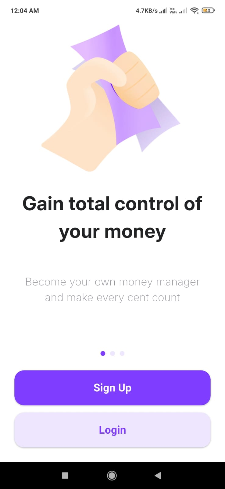
  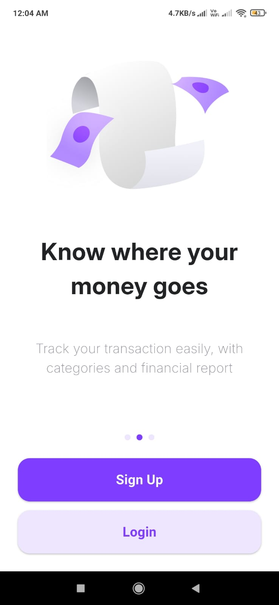
  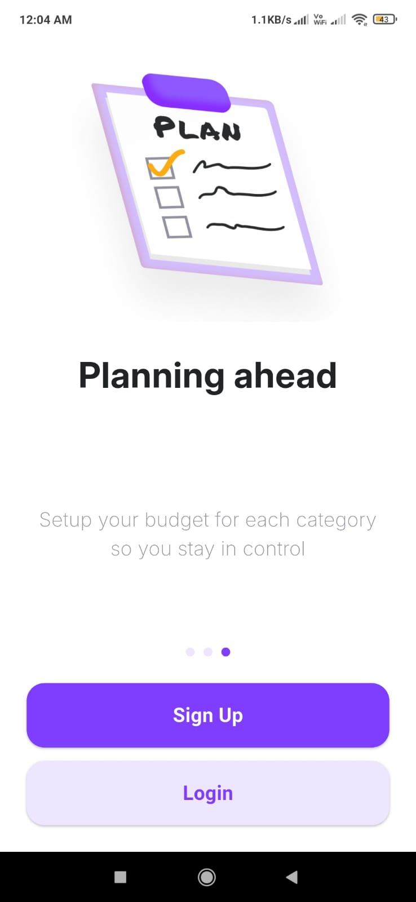
</p>

<p align="center">
  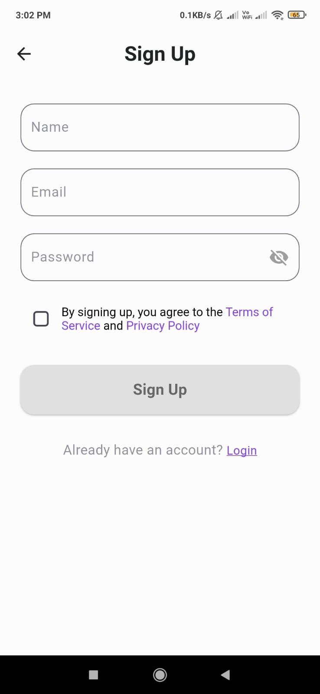
  
  
</p>


<p align="center">
  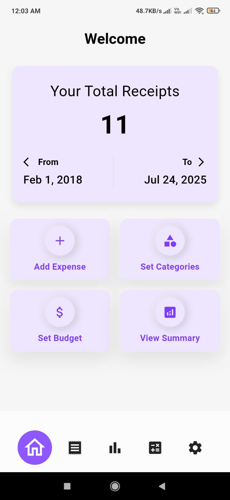
</p>


**Description:**
Expensely is a Flutter application designed to help users scan, manage, and analyze their receipts efficiently. The app integrates Firebase for user authentication and data storage, providing a seamless experience for tracking expenses.

## 📱Features

- **Receipt Scanning**: Users can scan receipts using the device camera and extract relevant data using an integrated Receipt API, allowing for quick data entry.

  <p align="center">
  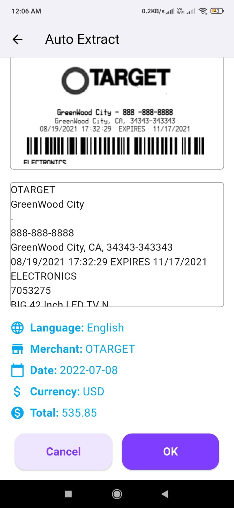
</p>

 

- **Expense Management**: The app allows users to categorize their expenses based on the extracted data, making it easier to track spending habits.

  <p align="center">
  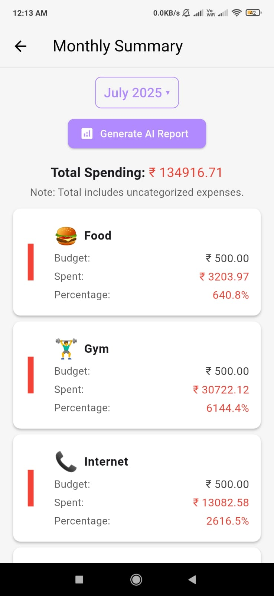
</p>


- **Gemini AI Integration**: Get Gemini powered insights into your spending habits.

  <p align="center">
  
</p>


- **Data Visualization**: Users can visualize their expenses through interactive pie charts and graphs, helping them understand their financial situation at a glance.

  <p align="center">
  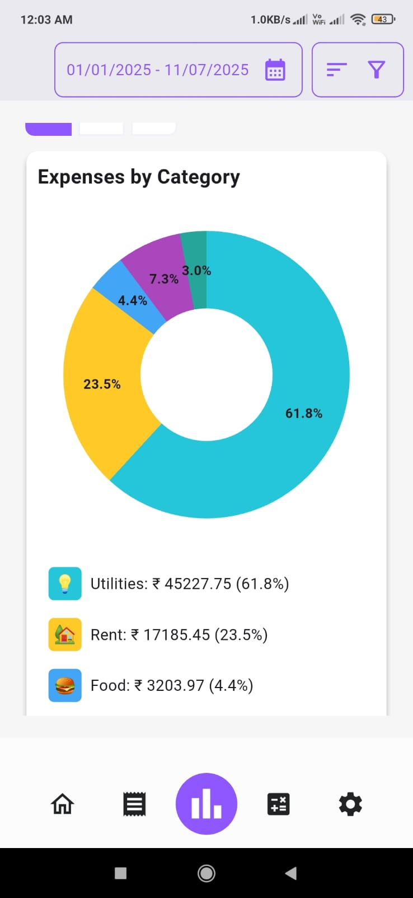
</p>


- **Budget Setting**: Users can set and manage budgets for different expense categories, with alerts for budget limits to promote better financial management.

  <p align="center">
  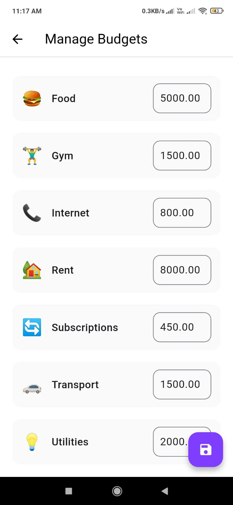
</p>

  
- **Custom Categories**: The app supports custom expense categories, enabling users to tailor their tracking to their specific needs.

  <p align="center">
  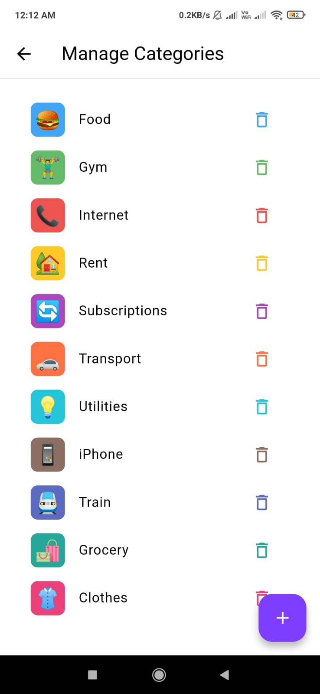
</p>


- **Bill Splitting**: Users can split the bill with other people.

  <p align="center">
  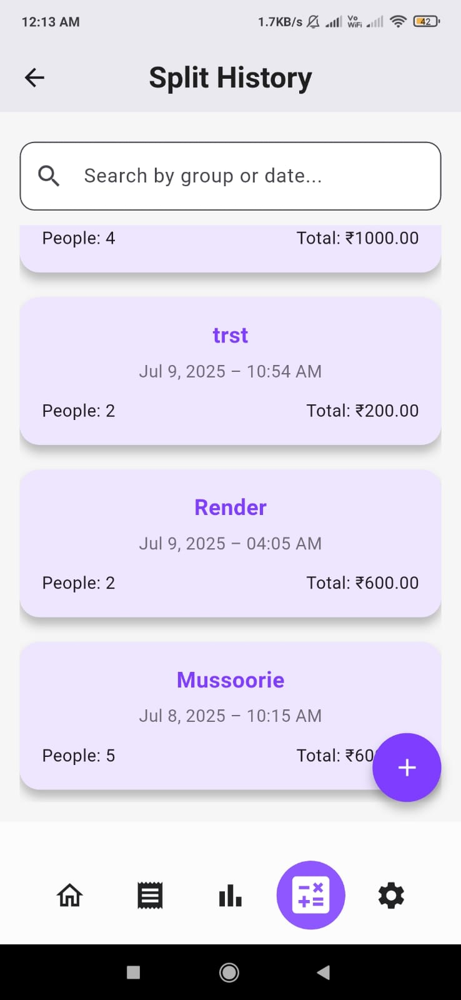
</p>


- **Settings**: The app has settings page to change the profile picture, logout & sign in another user.

  <p align="center">
  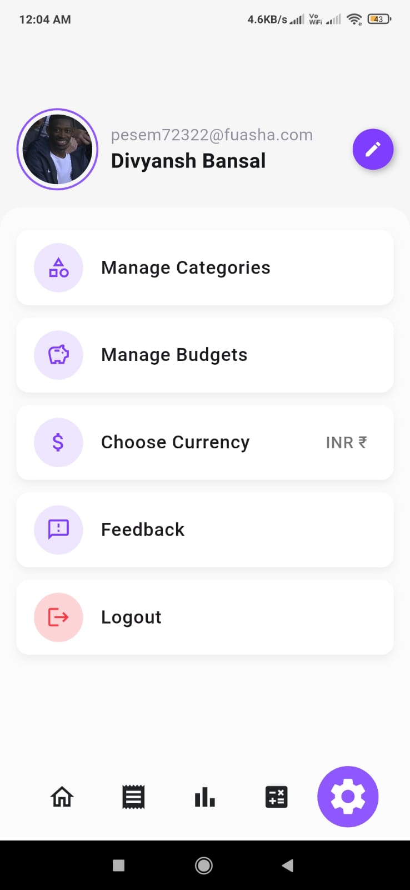
</p>

- **Offline Functionality**: The app supports offline mode, allowing users to access their receipts and data even without an internet connection.

 <p align="center">
  
</p>


## Platforms

- Android
- iOS

## Getting Started

To get a copy of the project up and running on your local machine, follow these steps:

1. Clone the repository:
   ```bash
   git clone https://github.com/vaibhavsingh7232/Expensely
   ```
2. Navigate to the Project Directory: Change into the project directory with the command:
   ```bash
    cd receipt_manager
   ```
3. Install Dependencies: Ensure all necessary dependencies are installed by running:
   ```bash
    flutter pub get
   ```
4. Run the Application: The application can be executed on an emulator/simulator or a physical device. Use the following command to launch the application:

   ```bash
   flutter run
   ```

   **For Android**:

   Ensure you have an Android emulator running or a physical Android device connected.
   You can connect a physical device via USB debugging or enable Wireless debugging:

   **For iOS**:

   Make sure you have an iOS simulator running or a physical iOS device connected.
   For physical devices, ensure that the device is set up for development by trusting your computer.

   Flutter will automatically detect the connected devices and launch the app accordingly.

## Dependencies

### Core

- **flutter**: Core SDK for building the app.

- **Node.js + Express + MongoDB** for the bill splitting feature(a separate backend for this particular feature we wanted to try this and we learned a lot from implementing two different backend frameworks and databases).


### Firebase Services

- **firebase_core**: Initializes Firebase services.
- **firebase_auth**: Manages user authentication.
- **cloud_firestore**: Stores and retrieves receipt data, supporting real-time syncing.
- **firebase_storage**: Handles storage for images and other files.
- **firebase_remote_config**: Enables dynamic fetching of remote configuration values.
- **cloud_functions**: Calls Firebase Cloud Functions to process OCR requests.

### Local Data Management

- **shared_preferences**: Stores local key-value pairs for user preferences and settings.
- **path_provider**: Locates directories on the device, useful for accessing file storage locations.

### Device Permissions and Features

- **permission_handler**: Requests and manages permissions for accessing device features like the camera and gallery.
- **camera**: Provides direct access to the device's camera for capturing receipts.
- **image_picker**: Allows users to select images from the gallery or take new photos.

### Image Processing

- **image**: Offers image manipulation capabilities such as resizing and formatting.

### Data Visualization

- **fl_chart**: Visualizes data with various types of customizable charts, ideal for spending analysis.

### Internationalization and Formatting

- **intl**: Handles internationalization and formats dates, times, and currencies.

### Network Communication

- **http**: Facilitates HTTP requests for communication with external APIs and services.

### User Experience Enhancements

- **emoji_picker_flutter**: Allows users to categorize expenses with emojis, adding an expressive layer to spending data.
- **smooth_page_indicator**: Useful for creating smooth and visually appealing page indicators.
- **flutter_speed_dial**: Enables a floating action button with multiple child actions, ideal for enhancing UI functionality.

### Utilities and Debugging

- **logger**: Provides structured logging for debugging and tracking app activities.'
  
### State Management
- **provider**: Added for managing state and dependencies within the app.

### Custom Widgets
- **flutter_custom_month_picker**: Provides a custom month picker for date selection.

## Receipt OCR (Optical Character Recognition) Feature

This project includes an OCR (Optical Character Recognition) feature designed to extract and analyze text from receipts. By leveraging Google Cloud Vision and Firebase Cloud Functions, the app enables users to scan receipts, parse essential information like merchant name, date, currency, and total amount, and store this data for further processing.

### How It Works

1. **Image Capture**: Users can upload an image of a receipt either by capturing it from the camera or selecting it from their gallery.

2. **Image Processing**: The captured image is resized and converted to Base64 format, ensuring that the image is optimized for fast and accurate text recognition.

3. **Cloud Processing**: The Base64 image data is sent to a Firebase Cloud Function, which calls Google Cloud Vision’s OCR API.
   The OCR service processes the image and extracts text content, returning it to the app.
4. **Text Extraction & Analysis**: Custom regex patterns are applied to the extracted text to parse specific details such as: **Merchant Name**, **Date**, **Currency**, **Total Amount**. This information is displayed to the user and can be saved for future reference and financial tracking.

5. **Error Handling**: The app is designed to handle errors in text extraction (such as missing fields or incomplete information), ensuring that only valid data is saved.

### Key Technologies Used

- **Google Cloud Vision API**: Powers the OCR functionality.
- **Firebase Cloud Functions**: Hosts the serverless functions that process and retrieve OCR data.
- **Regex Parsing**: Identifies specific fields within the extracted text.

______

## Google Gemini API Integration
The application uses the [Google Gemini API](https://aistudio.google.com/apikey/) to provide real-time insights into your spending.

_______
## Currency API Integration

The application uses the [Open Exchange Rates API](https://openexchangerates.org/) to provide real-time currency data. Key functionalities include:

- **Currency Codes Fetching**: The app can fetch a list of available currency codes from the Open Exchange Rates API.

- **Conversion Rates Fetching**: The service retrieves current conversion rates, allowing users to view expenses in their preferred currency.


## Acknowledgments

Thank you to the Flutter community and the contributors to the libraries used in this project.
